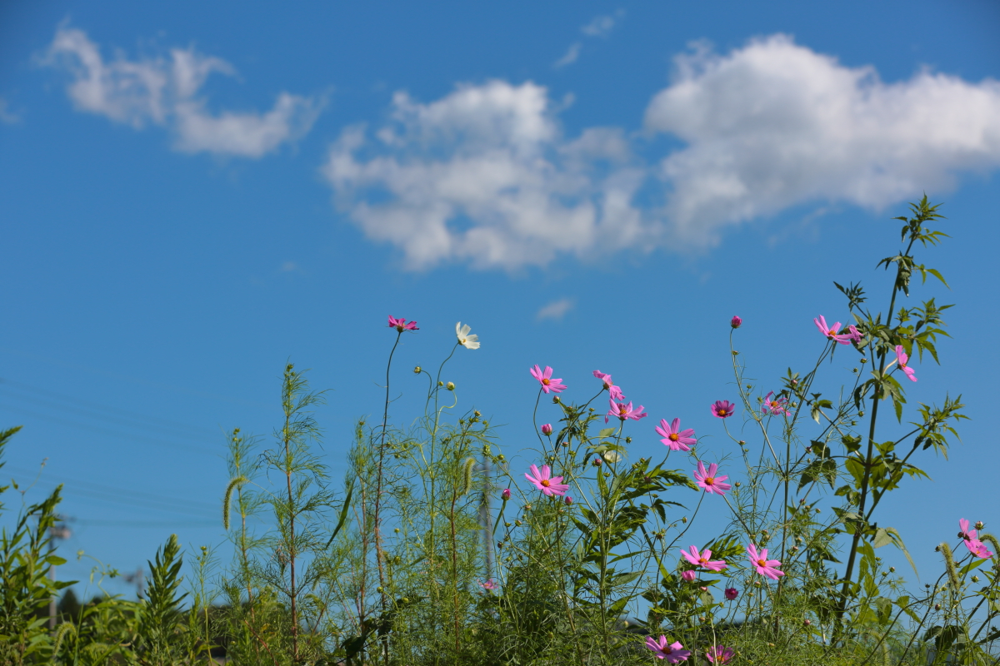
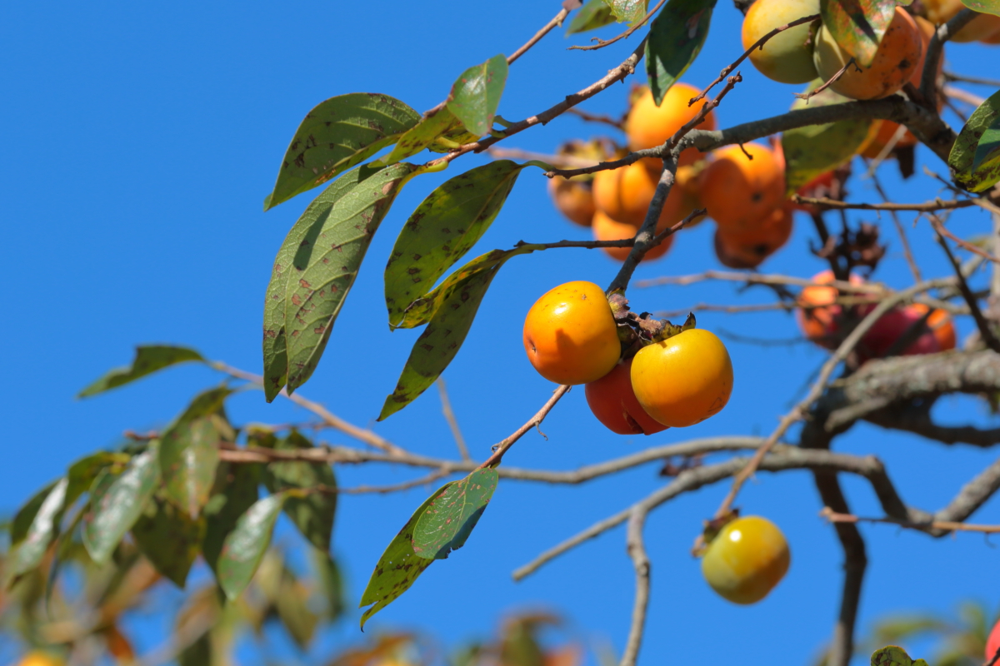

# mashiko

<html lang="ja">
 <head>
  <meta charset="utf-8" />
	 

<link href="https://cdnjs.cloudflare.com/ajax/libs/lightbox2/2.7.1/css/lightbox.css" rel="stylesheet">
 
</head>
<body>

  モバイル端末をお使いの場合は、画面を横向きにすると
  より見やすくご覧頂けます。

	
<h1><marquee behavior="alternate">!!! 2021年9月19日(日)栃木県芳賀郡益子町上山、コスモス祭りにお邪魔しました !!!</marquee></h1>
                                       
	

 アクセス用QRコード

	<h3>JR宇都宮駅から南東に位置する、益子コスモス祭りです。</h3>

<h3>実は、最初コスモス祭りの会場が見つけられず、親切な農家のお兄さんに聞くと、 「今年は中止ですよ」とのこと。</h3>	

<h3>確かに予定の場所では、すでに何かが刈り取られた後でした。 全く〜早くアナウンスしてよ〜(>_<)。 今回の写真は畦道にわずかに残ったお花たちです。</h3>

<h3>農家のお兄さんは、その後もせっせとお仕事に精を出していました。</h3>

<h3>農家のお庭では、柿が色づいていました。</h3>

<h4>↓益子、コスモス祭りHPへのリンク</h4>
	<a href="http://www.town.mashiko.tochigi.jp/page/page003171.html" target="_blank"><h2>益子コスモス祭り</h2></a>  

Map

<iframe src="https://www.google.com/maps/embed?pb=!1m14!1m12!1m3!1d6072.805388613951!2d140.076715996864!3d36.44469947550417!2m3!1f0!2f0!3f0!3m2!1i1024!2i768!4f13.1!5e0!3m2!1sja!2sjp!4v1632043062763!5m2!1sja!2sjp" width="600" height="450" style="border:0;" allowfullscreen="" loading="lazy"></iframe>

                                       

<marquee direction="left" scrollamount="5" width="85%">今回は畦道にわずかに残ったコスモスを撮影。中止のアナウンスがまだ無いですね〜、残念！ (^_^)/~hada</marquee>

  

 

<!-- フッタ -->
 <footer>
 Copyright 2021/09/19 S.Hada
	 </footer>
